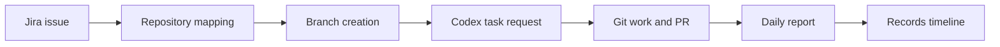
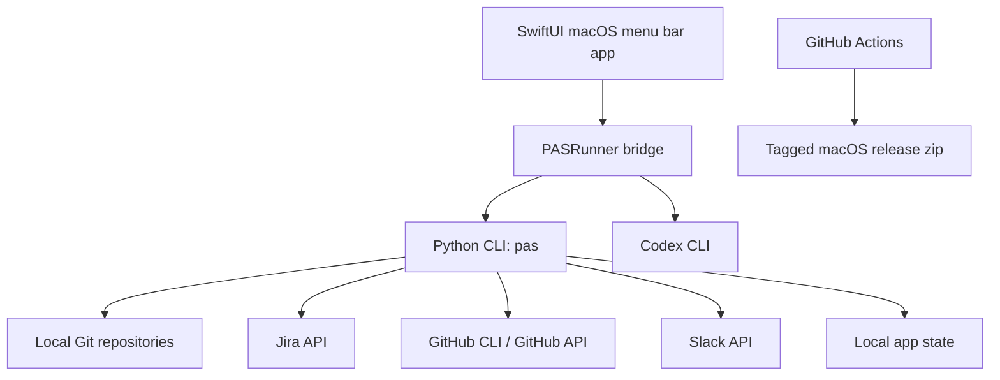

# PAS

**PAS** is a macOS-first personal automation system for developer workflows.

It started as a tool for one developer who wanted to keep Jira work, local Git repositories, Codex prompts, daily reports, quick notes, and overtime records in one place. The result is a local menu bar app that behaves like a small developer command center: it watches the day, helps start work, keeps evidence, and turns scattered activity into reportable records.

> Portfolio positioning: PAS demonstrates a practical integration of a native macOS app, a Python automation CLI, local developer tooling, GitHub Actions releases, and AI-assisted workflow design.

## Why This Exists

Developer work is rarely just code. A typical task jumps between Jira, Git branches, local repositories, pull requests, Slack reports, notes, and sometimes AI tools. PAS was built to reduce that switching cost.

Instead of treating each tool as a separate destination, PAS turns them into one local workflow:

```text
Check today's work
  -> connect Jira issue to repository
  -> create a branch with the right convention
  -> prepare a Codex task prompt
  -> track commits and repository state
  -> draft and submit a daily report
  -> keep the record for later review
```

## What PAS Does

| Area | What the app provides | Why it matters |
|---|---|---|
| Dashboard | Today's work, repository signals, Codex health, report state | Gives a fast morning overview without opening every service |
| Jira workflow | Issue list, planning details, attachments, comments, repository mapping | Keeps the work context close to the code |
| Repository control | Base branch tracking, working branch state, today's commits, PR/release summaries | Makes local repo status visible before work starts |
| Codex assistance | Standardized task prompts using Jira, repo, memo, and convention context | Produces more consistent AI-assisted development requests |
| Reports | Draft generation, Codex refinement, submission, local history | Turns daily activity into a reusable report |
| Records | Date-based timeline for reports, memos, Jira flow, overtime | Preserves a personal work memory |
| Profiles | Work/personal profile separation | Allows different repository and token contexts |
| Overtime | Calendar-based overtime entry and monthly allowance estimation | Tracks personal labor records locally |

## Main Workflow



The important design choice is that PAS does not only run commands. It keeps the context around those commands: which issue started the work, which repository is connected, which branch exists, what was committed today, and which report was submitted.

## Screenshots And Manual Assets

Real screenshots are useful for a portfolio version of this project. Recommended captures:

| Screenshot | Suggested filename | What to show |
|---|---|---|
| Main dashboard | `docs/portfolio/screenshots/dashboard.png` | Today overview, Codex status, Jira/repository summary |
| Jira work flow | `docs/portfolio/screenshots/jira-workflow.png` | Issue card, work-state badge, start button, repository mapping |
| Repository status | `docs/portfolio/screenshots/repositories.png` | Base branch, working branch, today commits, PR/release block |
| Report flow | `docs/portfolio/screenshots/report.png` | Draft, Codex refinement, submit flow |
| Records timeline | `docs/portfolio/screenshots/records.png` | Date-based report/memo/Jira/overtime timeline |
| Settings | `docs/portfolio/screenshots/settings.png` | Profiles, repositories, integrations, advanced settings |

Before publishing screenshots, hide or replace:

- company names, internal project names, Jira domains, and issue titles
- personal email addresses and local filesystem paths
- Slack channels, private repository names, tokens, and API keys
- business-sensitive comments, attachments, or report text

## Product Shape

PAS is designed around a few small but repeatable developer moments.

### 1. Start The Day

The dashboard gives a compact view of today's development situation:

- assigned Jira work
- newly detected Jira items
- active repositories
- repositories that need attention
- Codex availability
- linked Jira and active branch counts

The goal is not to show everything. The goal is to answer: **what needs attention first?**

### 2. Start A Jira Task

When a Jira issue is selected, PAS can:

- show planning text, attachments, and recent comments
- connect the issue to one or more managed repositories
- create a branch using the issue key
- open Codex with a structured task prompt
- keep the issue-to-repository relationship for later tracking

The work-state badge moves through:

```text
작업 전 -> 저장소 연결 -> 브랜치 준비 -> Codex 작업 요청
```

### 3. Work Across Local Repositories

PAS treats local repositories as first-class state. Each managed repository can show:

- base branch and current branch
- dirty working tree count
- ahead/behind status
- rebase or pull needs
- today's commits and merges
- pull request and release summaries
- automatic handling results

This is especially useful when one Jira task spans more than one repository.

### 4. Ask Codex With Better Context

PAS can generate Codex task prompts that include:

- the user's request
- Jira key and summary
- Jira planning details, attachments, and comments
- connected repositories
- repository conventions from files such as `AGENTS.md`
- recent work memos
- expected output style

This avoids rewriting the same setup context every time.

### 5. Write And Keep Reports

PAS can produce a daily report draft from:

- today's commits and merges
- Jira work context
- manual notes
- local work memos
- report-writing rules

Reports can be refined, submitted, and stored in the local record history. The records screen then shows activity by date, so old reports, notes, Jira flow, and overtime records remain searchable as a personal work memory.

## Architecture



| Layer | Role |
|---|---|
| SwiftUI app | Native macOS UI, menu bar entry, dashboards, settings, local windows |
| Python CLI | Automation commands, Jira/Git/Slack/report/overtime features |
| Local state | Profiles, issue-repository links, reports, memos, overtime records |
| Codex CLI | AI-assisted task execution and prompt-driven development workflows |
| GitHub Actions | Tag-based release build and GitHub Release publication |

## Repository Layout

```text
apps/macos/        SwiftUI menu bar app
src/               Python automation CLI and integrations
examples/          Example config, assignee, and report-agent files
scripts/           Local helper scripts
ops/launchd/       macOS launchd templates
docs/              Product notes and detailed usage
.github/           Tag-based release workflow and release notes
```

## Local Development

```bash
just setup
just install-dev
just check
just macos-app-build
```

Runtime settings are created under:

```text
~/Library/Application Support/PAS/
```

Example files live in [`examples/`](examples/).

## Release Flow

PAS uses tag-based GitHub Releases.

```bash
git push origin main
git tag v0.1.x
git push origin v0.1.x
```

When a `v*` tag is pushed:

1. GitHub Actions builds the Python CLI with PyInstaller.
2. GitHub Actions builds the SwiftUI macOS app.
3. The workflow assembles `PAS.app`.
4. The app is archived as `pas-macos-menubar-arm64.zip`.
5. A GitHub Release is created with the zip attached.

Release notes can be written in:

```text
.github/release-notes/v0.1.x.md
```

## Portfolio Highlights

This project is useful as a portfolio piece because it is not a toy integration. It is a practical local tool built around real developer workflow pressure.

Key engineering points:

- Native macOS UI with SwiftUI
- Python CLI automation backend
- Jira, GitHub, Slack, Git, Codex, and optional OpenAI API integration
- Local profile separation for work and personal contexts
- Token-based external system integration with local-only configuration
- Structured AI prompt generation for repeatable Codex tasks
- Date-based work history and report storage
- GitHub Actions release automation
- Iterative product design around personal daily usage

## Documentation

- [Detailed usage](docs/USAGE.md)
- [Product plan](docs/PRODUCT_PLAN.md)

## Current Status

PAS is best described as a **personal-use beta**: stable enough to use in a daily developer workflow, still evolving through real usage feedback.

The next polish areas are:

- better screenshot-based user manual
- more refined failure recovery guides
- richer weekly/monthly work review
- more repository-specific Codex task templates
- further decomposition of large SwiftUI views
